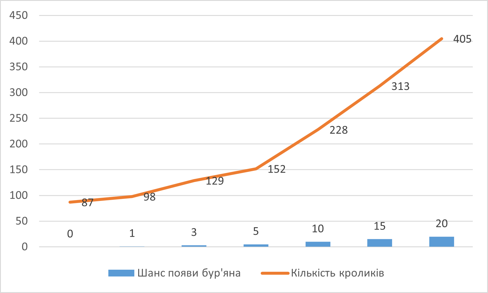
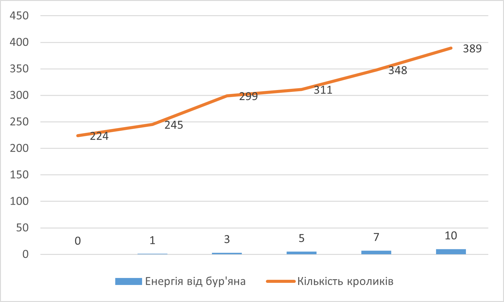
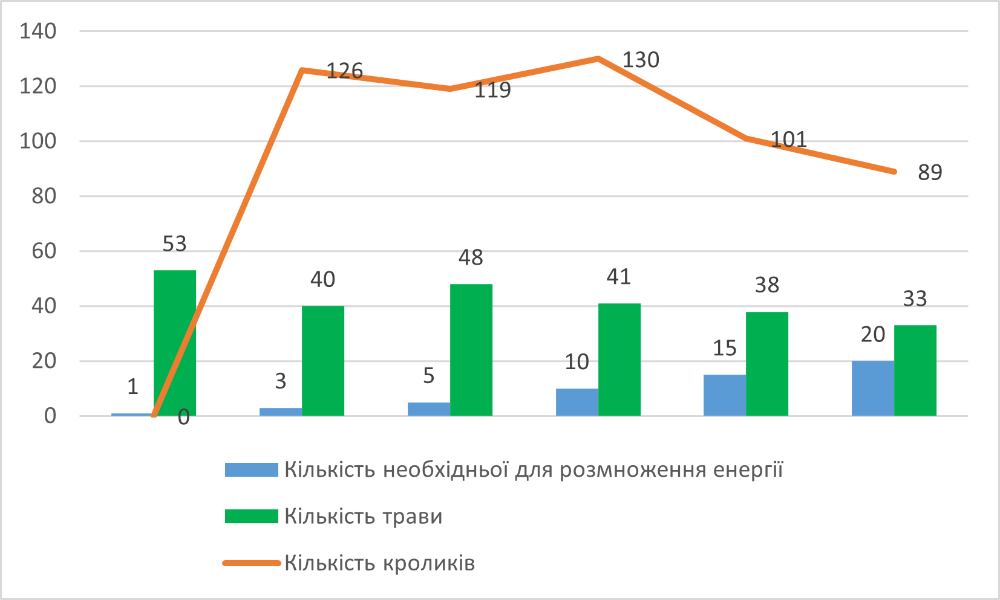

## Комп'ютерні системи імітаційного моделювання
## СПм-22-5, **Галицька Олександра Олегівна**
### Лабораторна робота №**1**. Опис імітаційних моделей та проведення обчислювальних експериментів

### Варіант 6, модель у середовищі NetLogo:
[Rabbits Grass Weeds](http://www.netlogoweb.org/launch#http://www.netlogoweb.org/assets/modelslib/Sample%20Models/Biology/Rabbits%20Grass%20Weeds.nlogo)

### Вербальний опис моделі:
Цей проект досліджує просту екосистему, що складається з кроликів, трави та бур’янів. Кролики блукають довкола випадковим чином, трава та бур’яни ростуть втпадковим чином. Коли кролик натикається на траву або бур’ян, він її поїдає і отримує енергію. Якщо кролик отримує достатньо енергії, він розмножується. Якщо він не отримує достатньо енергії, він вмирає.
Траву та бур’яни можна налаштувати так, щоб вони росли з різною швидкістю та давали кроликам різну кількість енергії. Модель можна використовувати для дослідження конкурентних переваг цих змінних.

### Керуючі параметри:
- **number** - контролює початковою кількістю кроликів.
- **birth-threshold** - встановлює рівень енергії, при якому кролики розмножуються.
- **grass-growth-rate** - контролює швидкість, з якою росте трава.
- **weeds-growth-rate** - контролює швидкість росту бур'янів.
- **grass-energy** - Кількість енергії, що додає трава.
- **weed-energy** - Кількість енергії, що додає бур'ян.

### Показники роботи системи:
- **count rabbits** - Поточна кількість кроликів.
- **Population** - графік, що відображає кількісні парамтери **grass, rabbits, weeds**.

### Примітки:
- Спочатку кроликам не вистачає трави, і багато кроликів гине. Але це дозволяє траві вільно рости, забезпечуючи достаток їжі для кроликів, що залишилися. 
- Кролики отримують енергію і розмножуються. Велика кількість кроликів призводить до нестачі трави, і цикл починається знову.
- Популяція кролів проходить через затухаючі коливання, зрештою стабілізуючись у вузькому діапазоні. Загальна кількість трави також коливається, не збігаючись із популяцією кролів.

### Недоліки моделі:
- Немає можливості отруїтися бур'яном.
- Немає поділу кроликів на особин чоловічого, жіночого та дитячого типу.
- Немає спраги до конкуренції та "битв", як у реальному житті.

## Обчислювальні експерименти
### 1. Вплив шансу на появу бур'яна(що дає більше енергії ніж трава) на швидкість розмноження.
Досліджується залежність швидкості розмноження кроликів від шансу появи бур'яна. Експеримент триває 300 тактів.
Експеримент проводяться при таких керуючих параметрах:
- **number** - 150
- **birth-threshold** - 15
- **grass-growth-rate** - 15
- **grass-energy** - 2
- **weed-energy** - 5

<table>
<thead>
<tr><th>Шанс появи бур'яна</th><th>Кількість кроликів</th></tr>
</thead>
<tbody>
<tr><td>0</td><td>87</td></tr>
<tr><td>1</td><td>98</td></tr>
<tr><td>3</td><td>129</td></tr>
<tr><td>5</td><td>152</td></tr>
<tr><td>10</td><td>228</td></tr>
<tr><td>15</td><td>313</td></tr>
<tr><td>20</td><td>405</td></tr>
</tbody>
</table>

Висновки експеременту:
Зі збільшенням шансу на появу бур'яна, що дає більше енергії ніж трава як і очікувалося зростає швидкість та можливість розмноження. При шансі **1-3** кількість кроликів дуже коливалася через те, що при появі нових кроликів вони поїдали усю траву та немали змогу розмножуватися. При шансі появи бур'яну **5,10,+...** амплітуда коливань знизилася.

### 2.  Вплив кількості енергії, що дає бур'ян на швидкість розмноження кроликів.
Досліджується залежність швидкості зростання кількості кроликів від кількості енергії, що додає бур'ян. Експеримент проводиться тривалістю 300 тактів.
Експеримент проводяться при таких керуючих параметрах:
- **number** - 150
- **birth-threshold** - 15
- **grass-growth-rate** - 15
- **weeds-growth-rate** - 5
- **grass-energy** - 5

<table>
<thead>
<tr><th>Енергія від бур'яна</th><th>Кількість кроликів</th></tr>
</thead>
<tbody>
<tr><td>0</td><td>224</td></tr>
<tr><td>1</td><td>245</td></tr>
<tr><td>3</td><td>299</td></tr>
<tr><td>5</td><td>311</td></tr>
<tr><td>7</td><td>348</td></tr>
<tr><td>10</td><td>389</td></tr>
</tbody>
</table>

Висновки експеременту:
Під час проводження експерименту та дослідження результатів його та минулого експерименту було зазначено, що кількість енергії, що дає бур'ян впливає на швидкість розмноження кроликів, але не настількі потужно, як впливає кількість самого бур'яну.

### 3. Вплив умов розмноження на кількість кроликів та трави
Досліджується залежність **rabbits** та **grass** від **birth-threshold**.
Експеримент проводяться при таких значеннях керуючих параметрів:
- **number** - 100
- **grass-growth-rate** - 10
- **weeds-growth-rate** - 0
- **grass-energy** - 5
- **weed-energy** - 0
*У цьому експерименті для доцільності та зменшення фактору рандомізації результатів було вирішено позбутися бур'янів.*

<table>
<thead>
<tr><th>Кількість необхідньої для розмноження енергії</th><th>Кількість трави</th><th>Кількість кроликів</th></tr>
</thead>
<tbody>
<tr><td>1</td><td>53</td><td>0</td></tr>
<tr><td>3</td><td>40</td><td>126</td></tr>
<tr><td>5</td><td>48</td><td>119</td></tr>
<tr><td>10</td><td>41</td><td>130</td></tr>
<tr><td>15</td><td>38</td><td>101</td></tr>
<tr><td>20</td><td>33</td><td>89</td></tr>
</tbody>
</table>

Висновки експеременту:
У експерименті під час підексперименту 1, при якому кількість необхідної для ромноження енергії становить 1 кролики настількі швидко почали розмножуватися, що занадто швидко з'їли усю траву та залишився один кролик, котрий помер один та під час його життя встигло вирости 53 одиниці трави. Тривалість підексперименту - 16 тактів.

У підекспериментах 3, 5, 10 не було помічено чогось незвичного.

У підекспериментах 15 та 20 було відмічено, що через високі вимоги до енергії для розмноження кроликам становиться тяжко добувати енергію та їх популяція зменшується.
